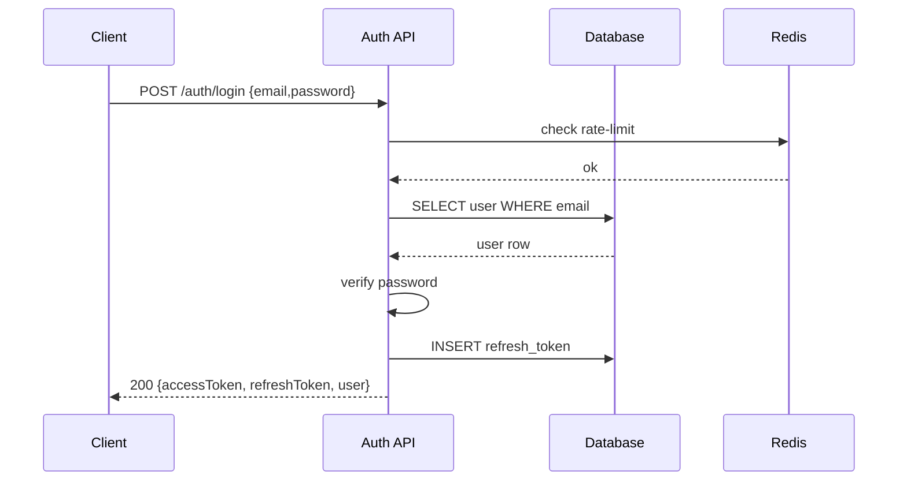

## Auth — Xác thực & Đăng ký / Đăng nhập

1. Tên chức năng
- Xác thực (Auth): Signup / Login / Refresh / Logout

2. Mục đích
- Quản lý phiên làm việc (authentication & session), cấp/thu hồi token, bảo vệ API.

3. Actor
- Mobile/Web client, Auth API, Database, Redis (rate-limit), Email/SMS provider (OTP).

4. Input
- Đăng ký (Signup): `{ email, password, displayName, phone? }`.
- Đăng nhập (Login): `{ email|phone, password }` hoặc OTP.
- Làm mới token (Refresh): `{ refreshToken }`.

5. Output
- Thành công: `200/201` JSON `{ accessToken, refreshToken, user }`.
- Lỗi (Errors): 400 / 401 / 403 / 409 / 429.

6. Flow xử lý (chi tiết)
- Signup: validate -> check duplicate -> hash password -> create user -> send verification (optional) -> create tokens -> respond.
- Login: rate-limit -> verify credentials -> create tokens -> update `last_login` -> respond.
- Refresh: validate refresh token -> rotate/invalidate -> issue access token.
- Logout: revoke refresh token and optionally blacklist access token.

7. Sequence Diagram

8. API Design
- `POST /auth/signup` — create user.
- `POST /auth/login` — login and return tokens.
- `POST /auth/refresh` — rotate/issue access token.
- `POST /auth/logout` — revoke refresh token.

9. Database liên quan
- `users` (profile + auth metadata).
- `refresh_tokens` (token, user_id, revoked, expires_at).

10. Validation / Business Rules
- Định dạng email, độ mạnh mật khẩu (password strength), chặn email xài một lần (disposable email).
- Giới hạn thử đăng nhập (Rate-limit) dựa trên IP/tài khoản (vd: 5 lần/10 phút).
- (Tuỳ chọn) Yêu cầu xác thực email trước khi cho phép thực hiện thao tác.

11. Error Handling
- `400`: payload không hợp lệ.
- `401`: thông tin đăng nhập sai.
- `403`: tài khoản bị khoá/chưa xác thực.
- `409`: trùng lặp dữ liệu (duplicate).
- `429`: vượt quá giới hạn request (rate limit).
