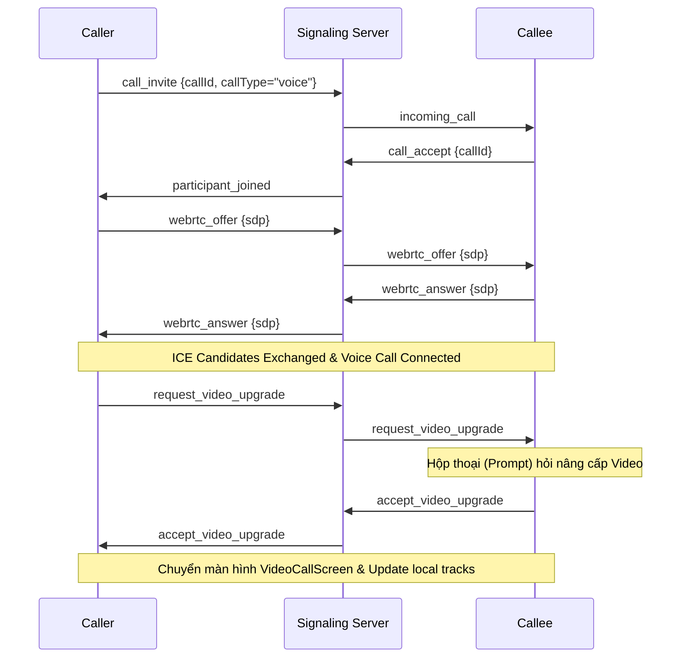
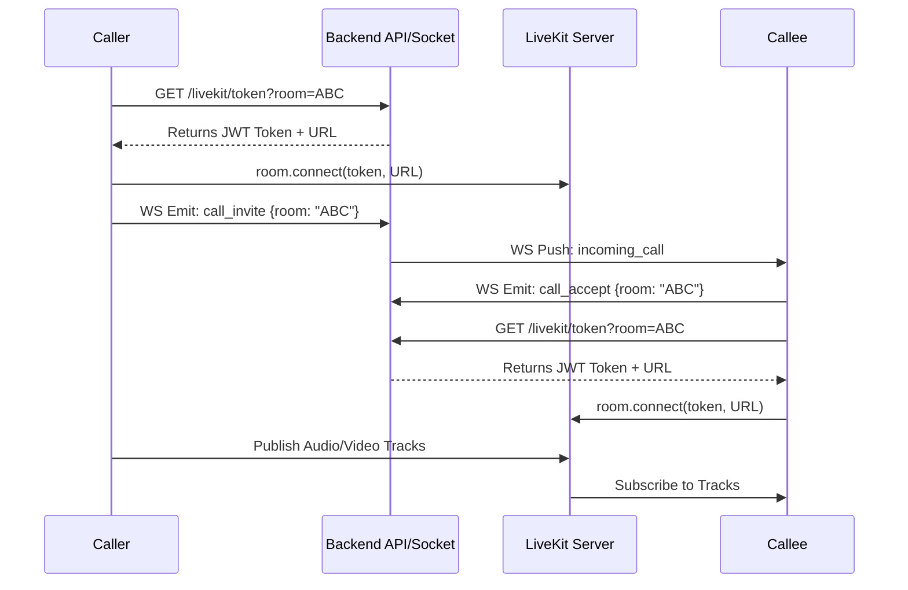

## Calls — Audio/Video Calls (1-1 & Group)

1. Tên chức năng
- Calls: Tính năng Gọi thoại / Gọi video. Bao gồm 2 kiến trúc rẽ nhánh riêng biệt:
  - **1-1 Call (P2P):** Dùng trực tiếp WebRTC (Polyfill) với Signaling thông qua Socket nội bộ. Hỗ trợ nâng cấp (Upgrade) từ Gọi Thoại sang Gọi Video.
  - **Group Call (SFU):** Tích hợp qua LiveKit Server phân phối streams.

2. Mục đích
- Thiết lập kết nối đa phương tiện (Audio/Video).
- Nhắn gửi tín hiệu mời (invite), chấp nhận, và định tuyến luồng dữ liệu truyền tải theo mô hình tối ưu nhất cho số lượng peer.

3. Actor
- Trực tiếp (P2P): Client người gọi (Caller), Client người nhận (Callee), Socket Server (Làm trạm trung chuyển Signaling SDP/ICE), Redis.
- Nhóm (SFU): Clients, LiveKit Server (SFU Media Provider), Socket Server (Phát tín hiệu Notify ban đầu), API Server (Cấp Token LiveKit).

4. Input
- 1-1 Call (WebRTC): Cấp quyền Camera/Mic, sự kiện WS `webrtc_offer`, `webrtc_answer`, `webrtc_ice_candidate`.
- Cập nhật 1-1 sang Video (Video Upgrade): WS sự kiện `request_video_upgrade`, `accept_video_upgrade`, `reject_video_upgrade`.
- Group Call (LiveKit): API `GET /livekit/token?room=[roomId]` và hàm SDK `room.connect()`.
- Global Call Events: `call_invite`, `call_accept`, `call_reject`, `call_end`.

5. Output
- Luồng âm thanh và hình ảnh theo thời gian thực.
- Giao diện Call 1-1 (CallScreen) được thay đổi sang (VideoCallScreen) ngay trong khi cuộc gọi đang tiếp diễn. Bắn record (System message) xuống Table `messages`.

6. Flow xử lý (chi tiết)
- **Luồng Gọi 1-1 (WebRTC P2P):** 
  Caller tạo `RTCPeerConnection` -> Phát `call_invite` (chỉ định loại `voice` hoặc `video`) qua Socket -> Callee ấn Accept, gửi `call_accept` -> Caller lập `Offer` (SDP) truyền qua Socket cho Callee -> Callee báo `Answer` (SDP) -> Bắn `ICE Candidates` thông qua WS Server (Hole punching). Media đi ngang qua nhau không qua máy chủ.
  - *Chuyển Voice sang Video:* Người dùng ở màn hình Voice ấn nút Video -> Emit `request_video_upgrade` -> Bên kia hiện Popup Alert (Đồng ý/Từ chối). Nếu đồng ý, trả về `accept_video_upgrade`, app update global state `callType='video'`, Replace trang sang màn hình `videoCall.tsx`, gọi hàm kích hoạt Camera SDK.
- **Luồng Gọi Nhóm (LiveKit SFU):**
  App báo `call_invite` đi các thành viên Group -> Người tham gia gọi REST Auth `GET /livekit/token?room=xyz` -> Trả về JWT AccessToken của LiveKit -> Thực thi `room.connect(url, token)` -> Từ lúc này Camera/Mic Data quy tụ về LiveKit Server để phân phát ngược về các users (Publish & Subscribe).

7. Sequence Diagrams

7.1 Kiến trúc Cuộc gọi 1-1 (Voice & Nâng cấp sang Video)

7.2 Kiến trúc Cuộc gọi Nhóm (LiveKit SFU)

8. API Design / Events
- Socket Events P2P: `webrtc_offer`, `webrtc_answer`, `webrtc_ice_candidate`.
- Socket Events Nâng cấp UI Video: `request_video_upgrade`, `accept_video_upgrade`, `reject_video_upgrade`.
- REST GET `/livekit/token`: Validate user Auth -> Render JWT Token mapping LiveKit Server.

9. Database liên quan
- Sử dụng tính năng "System Message" (`type=call`) lưu records lúc call xong. Cả Audio và Video đều xử lý thành một cuộc gọi thống nhất (cùng chung unique Call ID).

10. Validation / Business Rules
- Ở Group Call: Tự động ngắt băng thông nếu chập chờn. Giới hạn số người trong room.
- Nâng cấp Video: Cả 2 bên (Caller và Callee) phải đều bấm đồng ý. Nếu Client B chọn Reject, luồng trả về `reject_video_upgrade`, State vẫn giữ nguyên ở cuộc gọi Voice.

11. Error Handling
- `400` Thiếu Room ID lúc lấy Token LiveKit.
- Client từ chối biến đổi loại Video: Hiện Alert thông báo cho Client yêu cầu sự từ chối ("Chuyển đổi bị từ chối").
