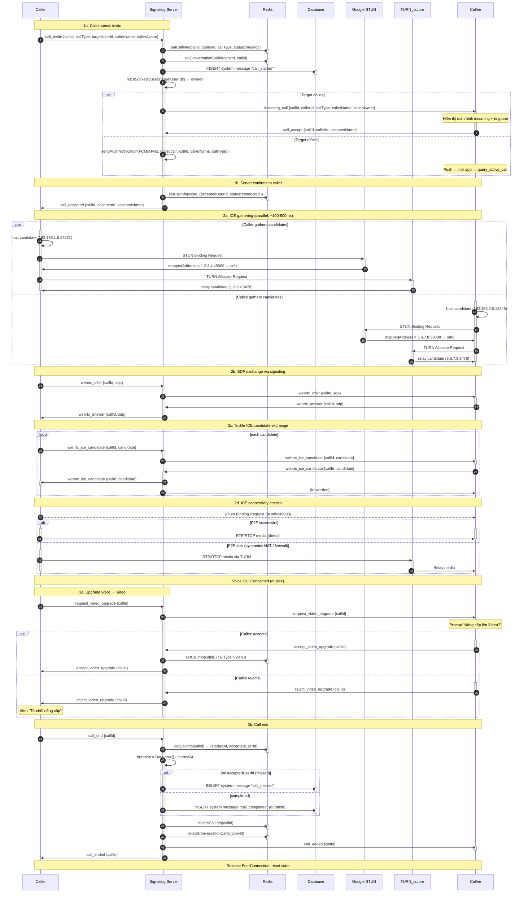
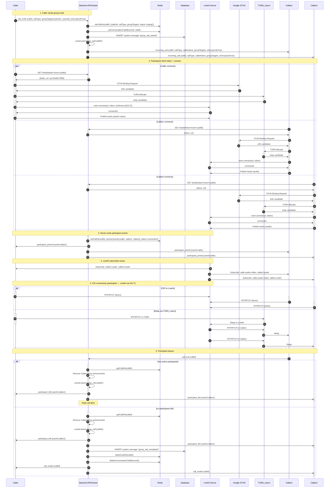
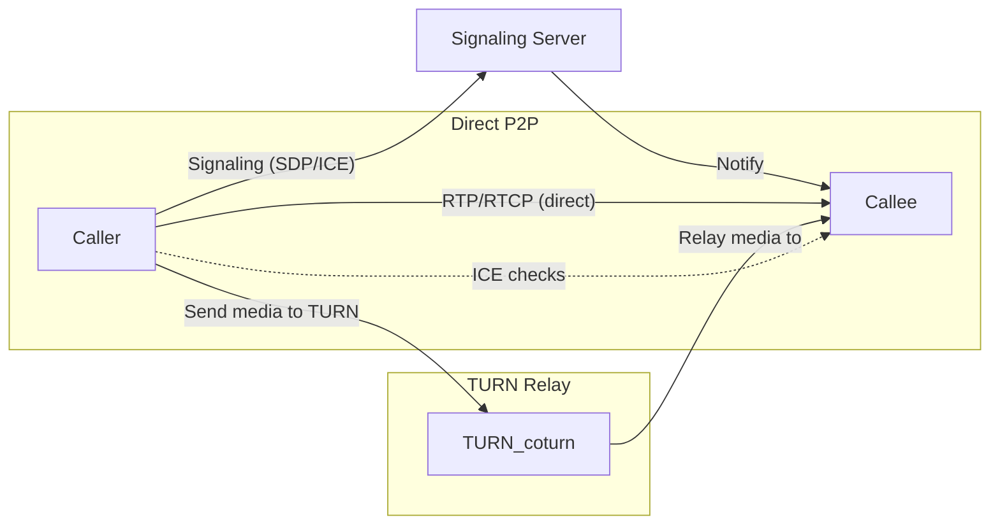

## Calls — Audio/Video Calls (1-1 & Group)

1. Tên chức năng
- Calls: Tính năng Gọi thoại / Gọi video. Bao gồm 2 kiến trúc rẽ nhánh riêng biệt:
  - **1-1 Call (P2P):** Dùng trực tiếp WebRTC (Polyfill) với Signaling thông qua Socket nội bộ. Hỗ trợ nâng cấp (Upgrade) từ Gọi Thoại sang Gọi Video. Sử dụng STUN and TURN (coturn) làm relay khi cần thiết để giải quyết NAT/Firewall.
  - **Group Call (SFU (Selective Forwarding Unit)):** Tích hợp qua LiveKit Server phân phối streams.

1. Mục đích
- Thiết lập kết nối đa phương tiện (Audio/Video).
- Nhắn gửi tín hiệu mời (invite), chấp nhận, và định tuyến luồng dữ liệu truyền tải theo mô hình tối ưu nhất cho số lượng peer.

1. Actor
 - Trực tiếp (P2P): Client người gọi (Caller), Client người nhận (Callee), Socket Server (Làm trạm trung chuyển Signaling SDP/ICE), Redis. Thêm TURN server (coturn) làm ICE relay khi peer-to-peer không thể thiết lập kết nối trực tiếp.
- Nhóm (SFU): Clients, LiveKit Server (SFU Media Provider), Socket Server (Phát tín hiệu Notify ban đầu), API Server (Cấp Token LiveKit).

1. Input
 - 1-1 Call (WebRTC): Cấp quyền Camera/Mic, cấu hình STUN and TURN (coturn) trong `RTCPeerConnection` config, sự kiện WS `webrtc_offer`, `webrtc_answer`, `webrtc_ice_candidate`.
- ICE candidates có thể được trao đổi trực tiếp hoặc được relay qua TURN (coturn) nếu NAT/Firewall chặn kết nối trực tiếp.
 - Cập nhật 1-1 sang Video (Video Upgrade): WS sự kiện `request_video_upgrade`, `accept_video_upgrade`, `reject_video_upgrade`.
- Group Call (LiveKit): API `GET /livekit/token?room=[roomId]` và hàm SDK `room.connect()`.
- Global Call Events: `call_invite`, `call_reject`, `call_end`, `incoming_call`, `participant_joined`, `participant_left`.

1. Output
- Luồng âm thanh và hình ảnh theo thời gian thực.
- Giao diện Call 1-1 (CallScreen) được thay đổi sang (VideoCallScreen) ngay trong khi cuộc gọi đang tiếp diễn. Bắn record (System message) xuống Table `messages`.

1. Flow xử lý (chi tiết)
- **Luồng Gọi 1-1 (WebRTC P2P):** 
  Caller tạo `RTCPeerConnection` -> Phát `call_invite` (chỉ định loại `voice` hoặc `video`) qua Socket -> Callee ấn Accept, gửi `call_accept` -> Caller lập `Offer` (SDP) truyền qua Socket cho Callee -> Callee báo `Answer` (SDP) -> Bắn `ICE Candidates` thông qua WS Server (Hole punching). Media đi ngang qua nhau không qua máy chủ.
  - *Chuyển Voice sang Video:* Người dùng ở màn hình Voice ấn nút Video -> Emit `request_video_upgrade` -> Bên kia hiện Popup Alert (Đồng ý/Từ chối). Nếu đồng ý, trả về `accept_video_upgrade`, app update global state `callType='video'`, Replace trang sang màn hình `videoCall.tsx`, gọi hàm kích hoạt Camera SDK.
- **Luồng Gọi Nhóm (LiveKit SFU):**
  Caller phát `call_invite` (kèm `groupTargets`, `callId`) -> Server gửi `incoming_call` tới các thành viên -> Người tham gia bấm Join và gọi REST Auth `GET /livekit/token?room=callId` -> Trả về JWT AccessToken + URL -> Thực thi `room.connect(url, token)` -> Từ lúc này Camera/Mic Data quy tụ về LiveKit Server để phân phát ngược về các users (Publish & Subscribe).

1. Sequence Diagrams

7.1 Kiến trúc Cuộc gọi 1-1 (Voice & Nâng cấp sang Video)

7.2 Kiến trúc Cuộc gọi Nhóm (LiveKit SFU)


7.3 STUN/TURN (coturn) & client config

- Mô tả: Khi peer-to-peer không thể thiết lập kết nối do NAT/Firewall, media sẽ được relay qua TURN server (ví dụ: coturn). TURN/ STUN URLs và credentials nên được cung cấp cho client qua signaling REST/WS (`GET /webrtc/ice-config` hoặc kèm trong `call_invite`).

- Ví dụ cấu hình client (JavaScript) cho `RTCPeerConnection`:
```javascript
const pc = new RTCPeerConnection({
  iceServers: [
    { urls: ['stun:stun.l.google.com:19302'] },
    {
      urls: ['turn:turn.example.com:3478?transport=udp','turn:turn.example.com:3478?transport=tcp'],
      username: 'turn-username',
      credential: 'turn-secret'
    }
  ]
});
```

- Cách cấp credentials cho TURN:
  - Ngắn hạn (recommended): Server tạo credential tạm thời (TTL) và trả cho client khi vào phòng/call (ví dụ JWT hoặc TURN REST API style).
  - Long-term: Sử dụng long-term credentials (coturn `lt-cred-mech`) và quản lý user trên server.

- Coturn deployment notes:
  - Chạy coturn với TLS, bật `lt-cred-mech` hoặc REST API nếu cần cấp token ngắn hạn.
  - Mở port 3478 (UDP/TCP) và TLS port nếu dùng `turns:`. Giữ logs và monitoring cho relay bandwidth.

### Vai trò của STUN — tại sao không thấy trong kiến trúc hệ thống?

STUN (Session Traversal Utilities for NAT) có một nhiệm vụ duy nhất: **giúp client khám phá địa chỉ IP public và port public của chính nó** sau khi qua NAT. Cụ thể:

1. Client gửi một gói tin UDP nhỏ đến `stun:stun.l.google.com:19302`.
2. Google STUN server nhìn thấy gói tin đến từ IP:port public nào → trả về địa chỉ đó cho client.
3. Client dùng địa chỉ public đó làm một **ICE candidate** (gọi là `srflx` candidate) để gửi cho peer kia qua signaling.

**Tại sao không xuất hiện trong kiến trúc hệ thống?**
- STUN **không relay media** — nó chỉ là một cú "hỏi đáp" UDP 1 lần, kéo dài vài mili-giây.
- Sau khi client có được public IP, STUN không tham gia gì thêm vào cuộc gọi.
- Các sơ đồ kiến trúc chỉ vẽ **đường media** (luồng RTP/RTCP), vì đó là phần quan trọng và tốn băng thông. STUN là bước chuẩn bị, không phải đường truyền media.
- Tóm lại: STUN nằm trong **pha gathering ICE candidates**, diễn ra ngay khi `RTCPeerConnection` được tạo, trước khi media flow bắt đầu.

8. API Design / Events
 - Socket Events P2P: `call_invite`, `incoming_call`, `call_accept`, `call_accepted`, `call_reject`, `call_end`, `webrtc_offer`, `webrtc_answer`, `webrtc_ice_candidate`.
 - Infrastructure: STUN/TURN servers (coturn) are required for reliable ICE traversal. TURN credentials/URLs are provided to clients as part of signaling or via config.

7.4 ICE flow (Direct vs TURN relay)

Trình bày luồng cố gắng thiết lập media giữa hai peer: ưu tiên kết nối trực tiếp, fallback sang TURN (coturn) khi thất bại.



Ghi chú: biểu đồ trên minh họa hai khả năng — client luôn cố gắng thiết lập kết nối trực tiếp trước; nếu ICE connectivity checks không thành công (do symmetric NAT, firewall, v.v.), client sẽ sử dụng TURN relay để truyền media.
- Socket Events Group Call: `call_invite`, `incoming_call`, `participant_joined`, `participant_left`, `call_end`.
- Socket Events Nâng cấp UI Video: `request_video_upgrade`, `accept_video_upgrade`, `reject_video_upgrade`.
- REST GET `/livekit/token`: Validate user Auth -> Render JWT Token mapping LiveKit Server.

1. Database liên quan
- Sử dụng tính năng "System Message" (`type=call`) lưu records lúc call xong. Cả Audio và Video đều xử lý thành một cuộc gọi thống nhất (cùng chung unique Call ID).

1.  Validation / Business Rules
- Ở Group Call: Tự động ngắt băng thông nếu chập chờn. Giới hạn số người trong room.
- Nâng cấp Video: Cả 2 bên (Caller và Callee) phải đều bấm đồng ý. Nếu Client B chọn Reject, luồng trả về `reject_video_upgrade`, State vẫn giữ nguyên ở cuộc gọi Voice.

1.  Error Handling
- `400` Thiếu Room ID lúc lấy Token LiveKit.
- Client từ chối biến đổi loại Video: Hiện Alert thông báo cho Client yêu cầu sự từ chối ("Chuyển đổi bị từ chối").

1.  Giải thích kiến trúc — FAQ

### Làm thế nào người nhận biết được có cuộc gọi đến?

Quy trình thông báo cuộc gọi đến trải qua 3 bước:

```
Caller App ──call_invite──▶ Socket Server ──incoming_call──▶ Callee App
                                                                  │
                                                            [callContext.tsx]
                                                                  │
                                                         setIncomingCall(info)
                                                                  │
                                                    Hiển thị màn hình Call Incoming
                                                         + đổ chuông (ringtone)
```

**Chi tiết từng bước:**

1. **Client Caller gửi `call_invite`:**
   - `mobile/context/callContext.tsx` — hàm `startCall()` gọi:
     ```typescript
     socketService.emit('call_invite', {
       callId, conversationId, targetUserId,
       callType, callerName, callerAvatar, ...
     });
     ```

2. **Server nhận và chuyển tiếp:**
   - `server/src/socket/callHandlers.ts` — handler `call_invite` (khoảng dòng 222-235):
     ```typescript
     const targetRoom = `user:${targetUserId}`;
     io.to(targetRoom).emit("incoming_call", {
       callId, conversationId, callerId, callerName,
       callerAvatar, callType, groupTargets, isGroupCall,
     });
     ```
   - Server cũng lưu thông tin call vào Redis (`setCallInfo`) và tạo system message trong DB.
   - Nếu target user **offline** (không có socket nào trong room `user:{id}`), server gửi **push notification** qua FCM/APNs.

3. **Client Callee nhận `incoming_call`:**
   - `mobile/context/callContext.tsx` — listener (khoảng dòng 116-142):
     ```typescript
     socketService.on('incoming_call', (data) => {
       // Kiểm tra không có active call khác
       setIncomingCall({ callId, conversationId, callType,
         remoteUserId: data.callerId, remoteName: data.callerName, ... });
       setCallStatus('incoming'); // → hiển thị UI + ringtone
     });
     ```
   - Call status `'incoming'` kích hoạt màn hình đổ chuông (ringing screen) ở `call.tsx` hoặc `videoCall.tsx`.

**Kiến trúc room Socket.IO cho phép điều này:**
- Khi user đăng nhập, socket của họ tự động join room `user:{userId}` (xem `server/src/socket/index.ts`).
- Server emit `incoming_call` đến room đó → **tất cả devices của cùng user** (phone, tablet, web) đều nhận được thông báo.
- Đây là cơ chế **server → client push notification realtime**, không phải polling.

### Tóm tắt luồng emit cho incoming_call

| Component | Hành động | File |
|-----------|-----------|------|
| Caller | `emit('call_invite', {...})` | `mobile/context/callContext.tsx` |
| Server | `io.to('user:{id}').emit('incoming_call', {...})` | `server/src/socket/callHandlers.ts:226` |
| Callee | `on('incoming_call', handler)` | `mobile/context/callContext.tsx` |
