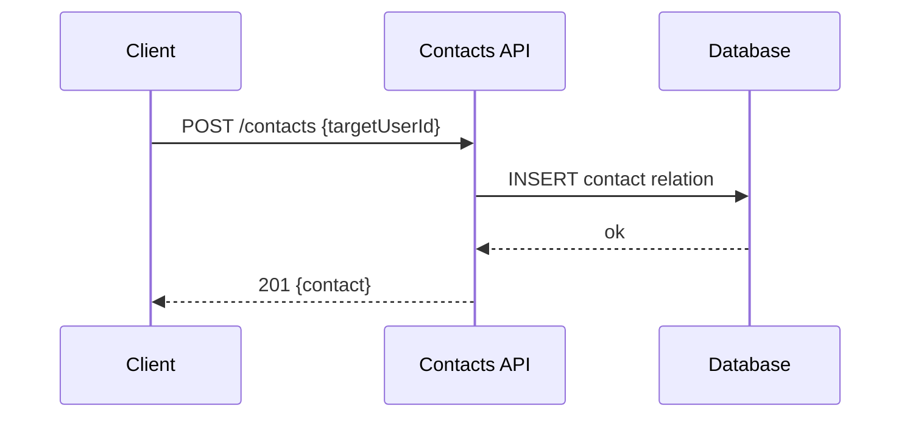

## Contacts — Danh bạ & Tìm kiếm người dùng

1. Tên chức năng
- Contacts / Address Book / Search users

2. Mục đích
- Quản lý danh bạ, tìm và thêm liên hệ, đồng bộ danh bạ điện thoại.

3. Actor
- Client, Contacts API, Database.

4. Input
- Gọi API REST: `GET /contacts`, `POST /contacts` (thêm mới), `DELETE /contacts/:id` (xóa).

5. Output
- Danh sách contacts, đối tượng contact được trả về khi thực hiện create/delete.

6. Flow xử lý (chi tiết)
- Fetch: authenticate -> đọc contacts (filter/paginate) từ DB.
- Add: kiểm tra target tồn tại -> tạo relation contact -> notify target (tuỳ chọn).
- Remove: soft-delete hoặc xóa relation.

7. Sequence Diagram

8. API Design
- `GET /contacts`
- `POST /contacts { targetUserId }`
- `DELETE /contacts/:id`

9. Database liên quan
- `contacts` or `friendships` lightweight relation table.

10. Validation / Business Rules
- Không thể tự thêm chính mình; target phải tồn tại; tuân thủ cài đặt chặn (block) / quyền riêng tư (privacy).

11. Error Handling
- `400` request không hợp lệ; `404` không tìm thấy target; `409` relation đã tồn tại; `403` bị block.
