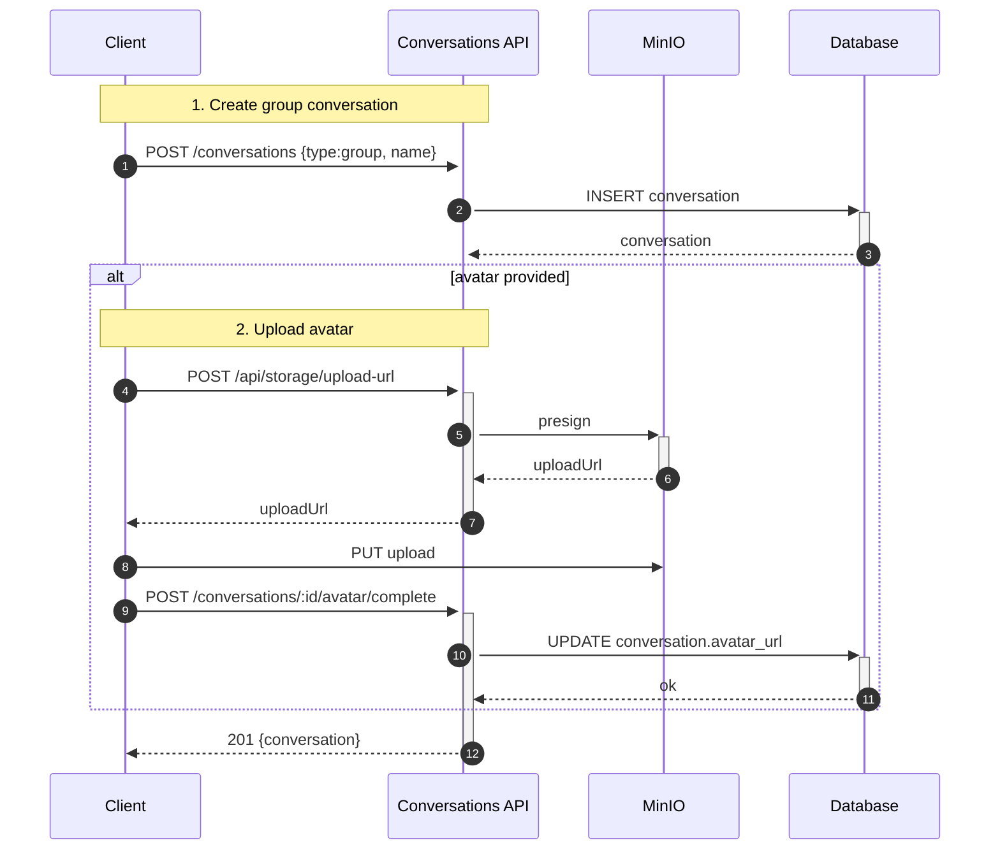

## Conversations — Danh sách & Quản lý cuộc trò chuyện

1. Tên chức năng
- Conversations (1:1, group) — list, create, update, delete

2. Mục đích
- Tổ chức thread, cung cấp metadata (last_message, unread_count) cho UI.

3. Actor
- Client, Conversations API, Database, Redis (cache), Socket server.

4. Input
- Gọi API REST: `GET /conversations`, `POST /conversations {participants, type}`, `GET /conversations/:id`.

5. Output
- Danh sách cuộc trò chuyện hỗ trợ phân trang (paginated list); đối tượng conversation trả về khi tạo thành công.

6. Flow xử lý (chi tiết)
- Read: kiểm tra cache Redis -> nếu miss thì truy vấn DB -> hydrate `last_message`/`unread` -> cache kết quả -> trả về cho client.
- Create: xác thực participants -> dedupe 1:1 -> chèn `conversation` và `participants` -> notify qua socket.
- Update/Delete: cập nhật metadata, invalidate cache, notify các participant.

7. Sequence Diagram
```mermaid
sequenceDiagram
  autonumber
  participant C as Client
  participant API as Conversations API
  participant R as Redis
  participant DB as Database

  Note over C,API: 1. Fetch conversations
  C->>+API: GET /conversations
  API->>+R: GET convs:user:<id>
  alt hit
    R-->>-API: cached
    API-->>-C: 200 {cached}
  else
    API->>+DB: SELECT conversations WHERE participant
    DB-->>-API: rows
    API->>+R: SET convs:user:<id>
    R-->>-API: ok
    API-->>-C: 200 {rows}
  end
```

7.1 Additional detailed flows

7.1.1 Create group conversation with avatar upload:


7.1.2 Pagination + cursor hydration (detailed):
```mermaid
sequenceDiagram
  autonumber
  participant C as Client
  participant API as Conversations API
  participant R as Redis
  participant DB as Database

  Note over C,API: 1. Fetch paginated conversations
  C->>+API: GET /conversations?cursor=abc
  API->>+R: GET convs:user:<id>:cursor:abc
  alt cache hit
    R-->>-API: cachedPage
    API-->>-C: 200 {cachedPage}
  else
    API->>+DB: SELECT ... LIMIT
    DB-->>-API: rows
    API->>+R: SET convs:user:<id>:cursor:abc
    R-->>-API: ok
    API-->>-C: 200 {rows}
  end
```

8. API Design
- `GET /conversations` (limit, cursor)
- `POST /conversations` (create)
- `GET /conversations/:id`
- `DELETE /conversations/:id` (soft-delete per user)

9. Database liên quan
- `conversations`, `conversation_participants`, `conversations_metadata`.

10. Validation / Business Rules
- Chỉ các thành viên (participants) mới có quyền truy cập; gộp/loại trùng (dedupe) khi tạo conversation 1:1; vô hiệu hoá cache (invalidation) mỗi khi có `new_message`.

11. Error Handling
- `403` cấm truy cập; `404` không tìm thấy; `409` conflict nếu trùng lặp thông tin tạo.

12. Tính năng mở rộng: Preferences & Media Vault
- **Tuỳ chọn Hội thoại (Pin, Mute, Đánh dấu chưa đọc):**
  Lưu dưới cấu trúc settings trong bảng `conversation_participants`. Client gọi `PUT /conversations/:id/mute` -> Set flag `is_muted` / `is_pinned` -> Làm mới cache (Invalidate Cache) Redis. Trạng thái Push Notification Worker sẽ dựa vào bảng này để chặn gửi Push nếu bị mute.
- **Tổng hợp File/Media (`getConversationMedia`):**
  App gọi `GET /chat/getConversationMedia` để liệt kê album ảnh, video hoặc file gắn sẵn (joins SQL với bảng `message_attachments`) tách biệt thay vì load toàn bộ text. Dữ liệu hồi về dưới dạng Pagination UI theo dạng timeline.
- **Xóa / Dọn dẹp Box Chat (`deleteConversation`):**
  Thực thi theo chuẩn Soft-Delete (xóa cục bộ cho một tài khoản cụ thể): cập nhật `deleted_at` của participant -> không tải về lại tin nhắn trước cột mốc đó nữa.
