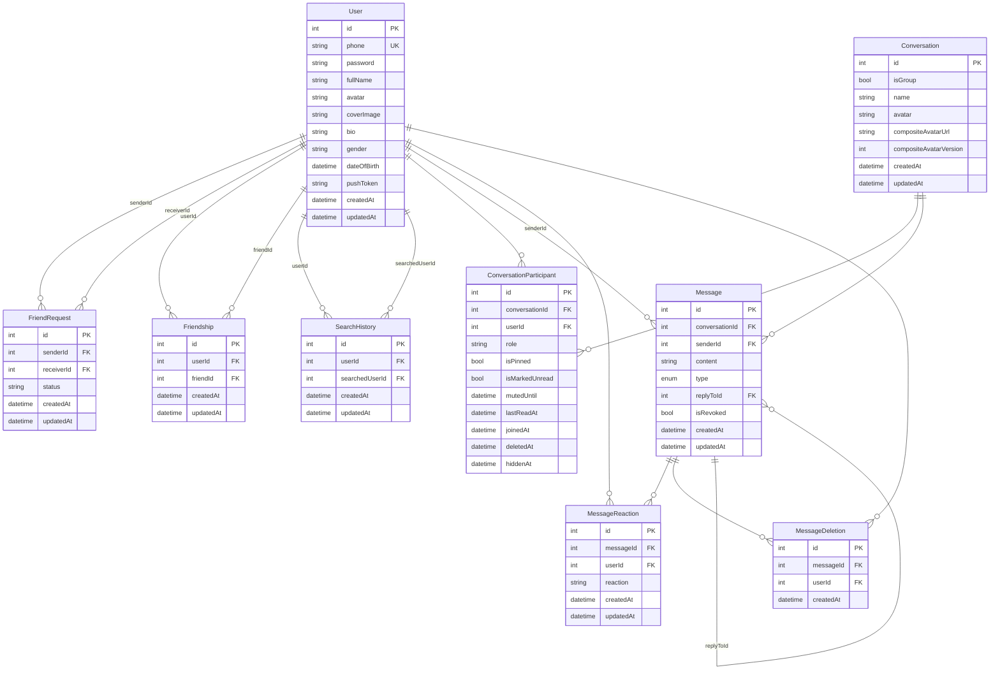

# Database ERD

> Sơ đồ thực thể - quan hệ (Entity-Relationship Diagram) của database `chat_app`.

## Tổng quan

- **DBMS:** MySQL 8.0
- **ORM:** Prisma (trên server)
- **Tổng số bảng:** 8
- **Tổng số enum:** 1 (`MessageType`)

---

## Sơ đồ ERD



---

## Mô tả chi tiết các bảng

### `users`
Bảng trung tâm lưu thông tin tài khoản người dùng. Mỗi người dùng có số điện thoại duy nhất (`phone` UK).

### `conversations`
Đại diện cho một cuộc hội thoại — có thể là **1-1** (`isGroup = false`) hoặc **nhóm** (`isGroup = true`). `name` và `avatar` chỉ có ý nghĩa với nhóm. `compositeAvatarUrl` là ảnh đại diện tự ghép từ avatar các thành viên.

### `conversation_participants`
Bảng trung gian giữa `User` và `Conversation`, chứa thêm các thông tin riêng của từng thành viên:
- `role`: `member` | `admin` | `owner`
- `isPinned`: ghim hội thoại
- `isMarkedUnread`: đánh dấu chưa đọc
- `mutedUntil`: tắt thông báo đến thời điểm
- `lastReadAt`: thời gian đọc tin nhắn cuối
- `deletedAt` / `hiddenAt`: soft-delete và ẩn hội thoại

### `messages`
Lưu tất cả tin nhắn. `type` là enum `MessageType` gồm: `text`, `image`, `video`, `audio`, `file`, `location`, `call`, `sticker`, `system`, `contact`, `image_group`, `revoked`.

- `replyToId`: tự tham chiếu đến chính nó, dùng cho cơ chế trả lời tin nhắn.
- `isRevoked`: tin nhắn đã thu hồi.

### `message_reactions`
Mỗi dòng là một reaction (emoji) của user lên message. **Ràng buộc unique `[messageId, userId]`** — mỗi user chỉ reaction 1 lần cho mỗi message.

### `message_deletions`
Theo dõi user nào đã xóa tin nhắn nào. Dùng cho cơ chế "xóa chỉ với tôi" — không xóa vật lý khỏi database.

### `friend_requests`
Lưu các lời mời kết bạn. `status`: `pending` | `accepted` | `rejected`. **Unique `[senderId, receiverId]`** — chỉ một lời mời đang chờ giữa một cặp.

### `friendships`
Khi lời mời được chấp nhận, một bản ghi được tạo ở đây. Mỗi cặp bạn bè có 2 bản ghi (A→B và B→A) để dễ query.

### `search_history`
Lưu lịch sử tìm kiếm người dùng. **Unique `[userId, searchedUserId]`** — chỉ lưu lần tìm kiếm mới nhất.

---

## Quan hệ chính

| # | Quan hệ | Kiểu | Ghi chú |
|---|---------|------|---------|
| 1 | User ↔ User (bạn bè) | N:M qua `friendships` | Mỗi cặp 2 bản ghi |
| 2 | User ↔ User (kết bạn) | N:M qua `friend_requests` | Có trạng thái pending/accepted/rejected |
| 3 | User ↔ Conversation | N:M qua `conversation_participants` | Có thêm thuộc tính (role, pin, mute, ...) |
| 4 | User ↔ Message (reaction) | N:M qua `message_reactions` | Unique mỗi user 1 reaction/message |
| 5 | User ↔ Message (xóa) | N:M qua `message_deletions` | Xóa phía user, không ảnh hưởng người khác |
| 6 | Message ↔ Message (reply) | 1:N tự tham chiếu | `replyToId` → `messages.id` |
| 7 | Conversation → Message | 1:N | Xóa conversation → cascade xóa messages |
| 8 | User → Message | 1:N | `senderId` → `users.id` |
| 9 | User → SearchHistory | 1:N | Lịch sử tìm kiếm của user |

---

## Enum `MessageType`

```
text, image, video, audio, file, location, call, sticker, system, contact, image_group, revoked
```
