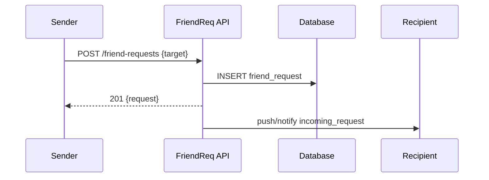

## Friend Requests — Lời mời kết bạn

1. Tên chức năng
- Friend Requests (send/accept/reject)

2. Mục đích
- Quản lý luồng gửi và xử lý yêu cầu kết bạn giữa người dùng.

3. Actor
- Client gửi (Sender), Client nhận (Recipient), FriendRequests API, Database, Notifications.

4. Input
- Gọi REST API: `POST /friend-requests { targetUserId }`, `POST /friend-requests/:id/accept`, `POST /friend-requests/:id/reject`.

5. Output
- Đối tượng friend request; tạo mới relation `friendship` khi accept.

6. Flow xử lý (chi tiết)
- Send: kiểm tra target hợp lệ -> tạo hàng `friend_request` -> notify recipient.
- Accept: kiểm tra request & recipient -> tạo relation `friendship` -> đánh dấu request accepted -> notify cả hai bên.
- Reject: đánh dấu rejected và notify sender.

7. Sequence Diagram

8. API Design
- `POST /friend-requests`
- `GET /friend-requests`
- `POST /friend-requests/:id/accept`
- `POST /friend-requests/:id/reject`

9. Database liên quan
- `friend_requests` (from_user, to_user, status, created_at).
- `friendships`/`contacts` created on accept.

10. Validation / Business Rules
- Ngăn chặn tạo request chờ nhận lặp lại (duplicate pending); tuân thủ danh sách chặn (block lists); user không thể gửi request cho chính mình.

11. Error Handling
- `400` payload không hợp lệ; `404` không tìm thấy yêu cầu; `409` bản ghi đã tồn tại/dupe; `403` bị chặn (blocked).
