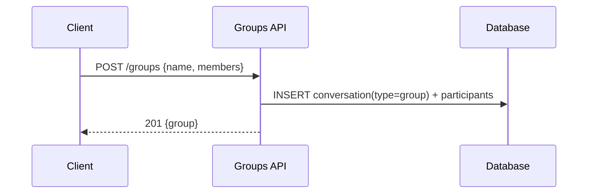

## Groups — Quản lý nhóm

1. Tên chức năng
- Quản lý nhóm (Group management): tạo nhóm, thêm/bớt thành viên, cập nhật thông tin nhóm

2. Mục đích
- Tạo và quản lý cuộc trò chuyện nhóm, phân quyền và hiển thị danh sách thành viên.

3. Actor
- Client, Groups API, Database, Socket server.

4. Input
- Gọi REST API: `POST /groups`, `PUT /groups/:id`, `POST /groups/:id/members`, `DELETE /groups/:id/members/:memberId`.

5. Output
- Đối tượng `group` trả về; danh sách member trả về khi query/update.

6. Flow xử lý (chi tiết)
- Create: kiểm tra creator hợp lệ -> tạo `conversation` với `type=group` -> chèn `participants` -> notify các thành viên.
- Add/Remove: kiểm tra quyền (permissions) -> cập nhật participants -> notify.

7. Sequence Diagram

8. API Design
- `POST /groups`, `GET /groups/:id`, `PUT /groups/:id`, `POST /groups/:id/members`, `DELETE /groups/:id/members/:memberId`.

9. Database liên quan
- `conversations` (type=group), `conversation_participants`.

10. Validation / Business Rules
- Chỉ có admin/người tạo (creator) là có quyền thêm/xoá member (tuỳ cấu hình config); giới hạn số lượng member tối đa.

11. Error Handling
- `403` không có quyền (no-permission); `404` không tìm thấy group; `409` member đã nằm trong nhóm.

12. Tính năng mở rộng: Rời nhóm & Giải tán nhóm (Advanced Group Actions)
- **Rời khỏi Nhóm (Leave Group):**
  Client gọi `POST /groups/:id/leave` -> API tháo bỏ khoá quan hệ ở cơ sở dữ liệu `conversation_participants` -> Broadcast Socket báo Member đã rời đi -> Update lại hệ thống hệ điều hành (List Chat).
- **Giải tán Nhóm (Disband Group):**
  Quyền cao nhất dành cho Group Admin. Khi gọi lệnh `POST /groups/:id/disband` -> System cập nhật `type` hoặc `status` của table `conversations` thay vì xoá cứng hoàn toàn (tuỳ logic DB) -> Tự động kích kick-out toàn bộ member -> Xóa room real-time liên đới thông qua Socket event `group.disbanded`.
