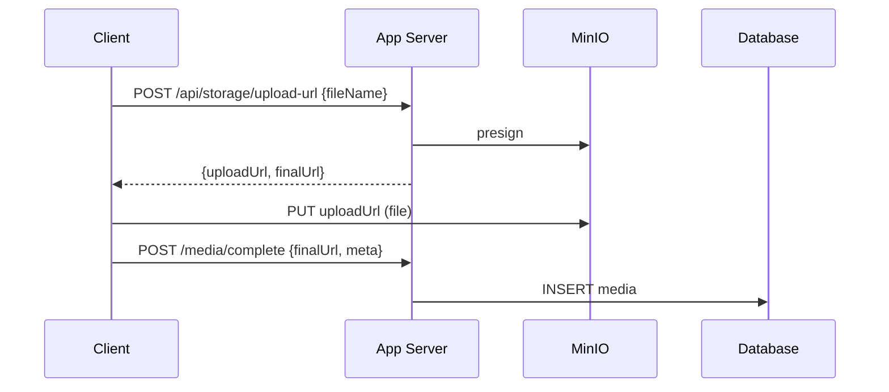
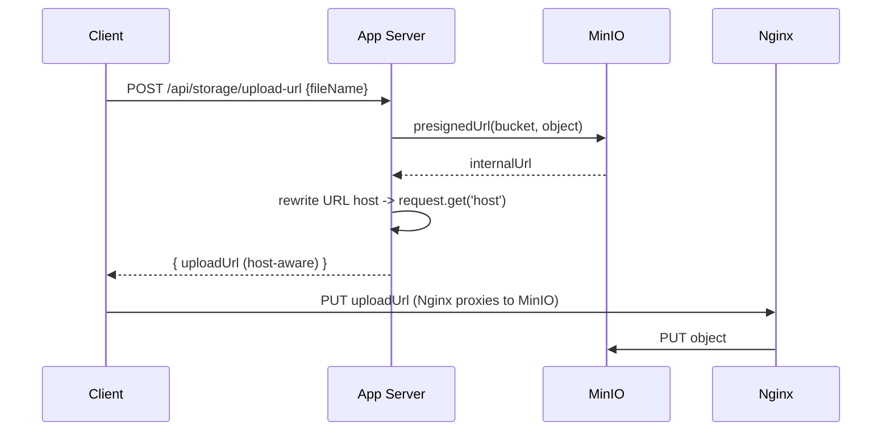
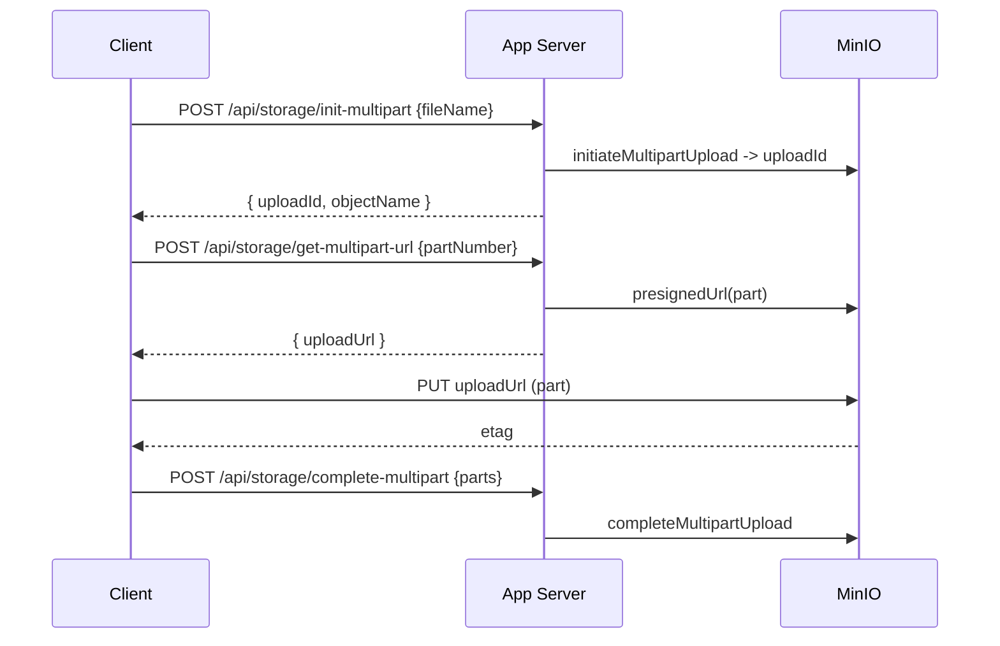
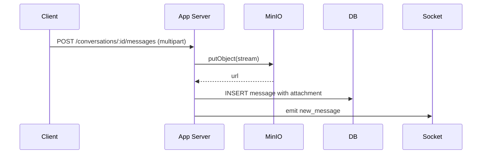
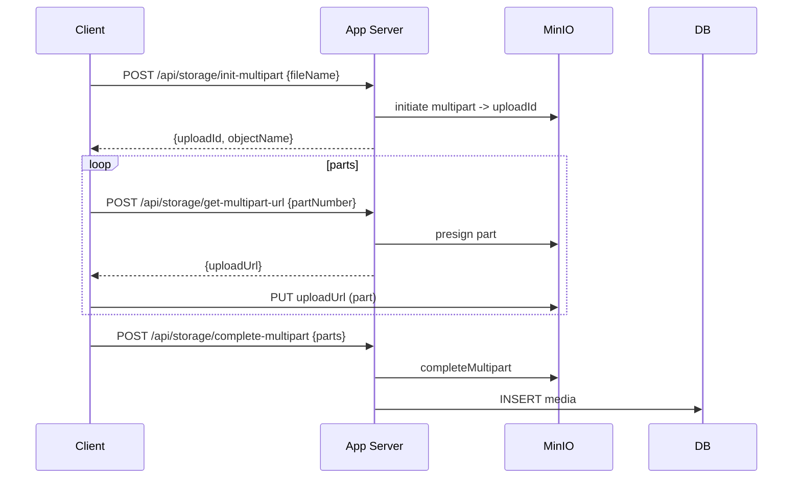

## Media — Upload & Management

1. Tên chức năng
- Media upload: images, audio, video, generic files (presigned or multipart)

2. Mục đích
- Lưu trữ file media an toàn, cung cấp URL công khai qua Nginx/MinIO, sinh thumbnails.

3. Actor
- Client, Storage (MinIO), App API, Worker (thumbnail/virus-scan), Database.

4. Input
- Gọi REST để presign: `POST /api/storage/upload-url` hoặc upload qua các endpoint API server-side xử lý kiểu multipart (`init`, `part`, `complete`).

5. Output
- Chuỗi trả về bao gồm `uploadUrl` (presigned host) kèm `finalUrl`, hoặc trả thẳng `finalUrl` sau khi upload `complete`; trả về metadata của tài nguyên media.

6. Flow xử lý (chi tiết)
- Presigned single PUT: client yêu cầu presign -> PUT lên storage -> client thông báo hoàn tất -> server kiểm tra và tạo media record.
- Multipart: init -> lấy presigned URL cho từng part -> client PUT các part -> complete -> server gọi completeMultipart và tạo media record.
- Server-side upload: client upload lên API -> server stream tới MinIO -> tạo media record.

7. Sequence Diagrams

7.1 Host-aware presign rewrite (Nginx proxy) — client sees public host URL

7.2 Multipart part signing details

7.3 Server-side direct upload handling (streaming to MinIO)

7.4 Multipart end-to-end (client loop example)

8. API Design
- `POST /api/storage/upload-url`
- `POST /api/storage/init-multipart`
- `POST /api/storage/get-multipart-url`
- `POST /api/storage/complete-multipart`

9. Database liên quan
- `media` (owner, url, mime, size, width/height, duration, created_at).

10. Validation / Business Rules
- Giới hạn kích thước tối đa cho mỗi loại file (chẳng hạn images 10MB, video 200MB); cho phép theo whitelist định dạng mime; quản lý dung lượng (quota) mỗi user nếu cần.

11. Error Handling
- `400` thiếu parameters; `403` cấm truy cập object; `413` tải trọng (payload) kích thước quá lớn; `500` lỗi storage/hoàn tất upload.
