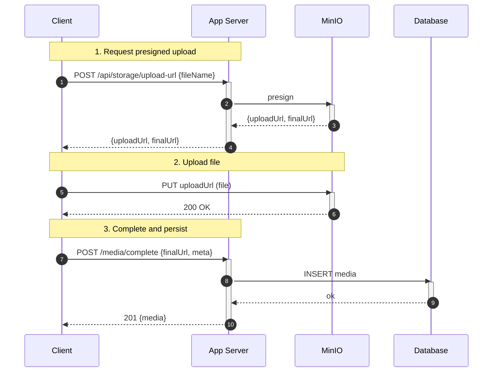
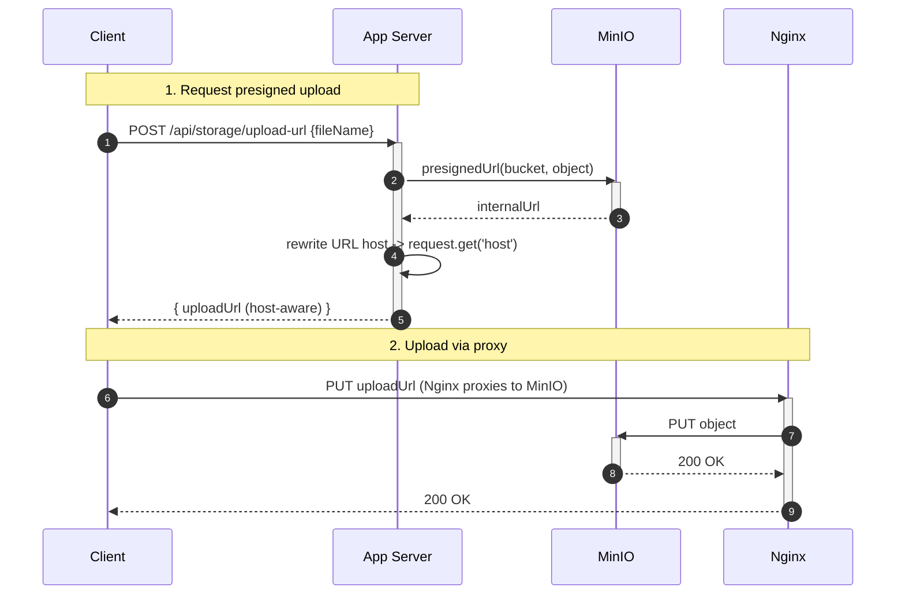
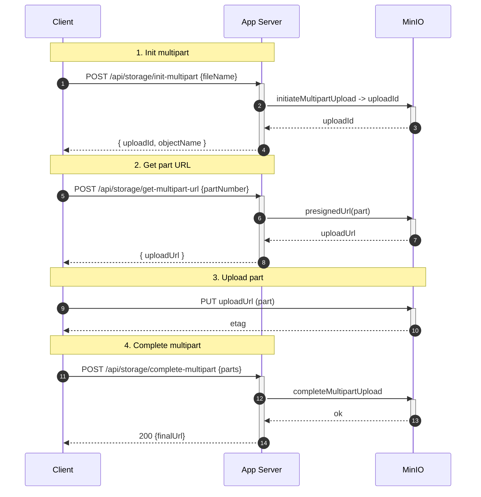
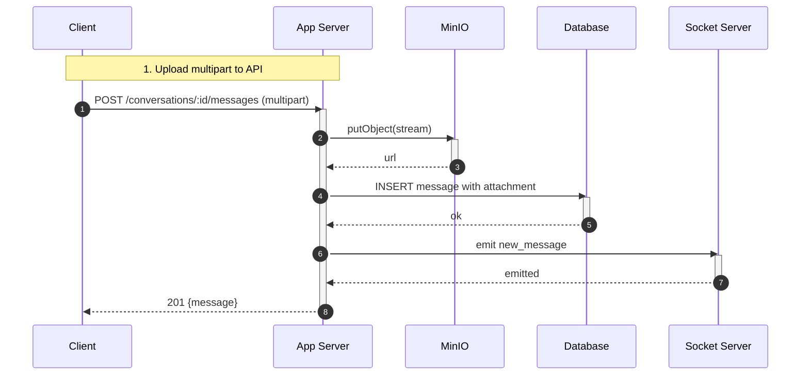
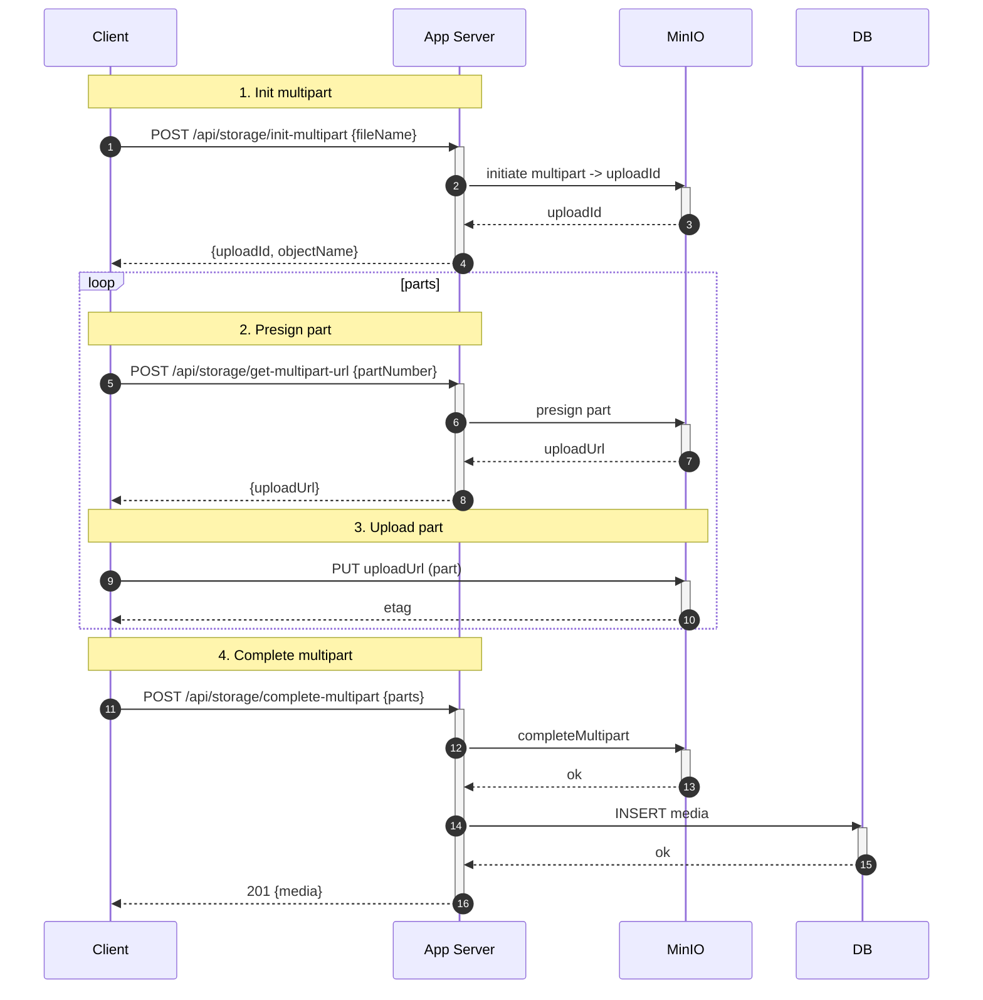

## Media — Upload & Management

1. Tên chức năng
- Media upload: images, audio, video, generic files (presigned or multipart)

2. Mục đích
- Lưu trữ file media an toàn, cung cấp URL công khai qua Nginx/MinIO, sinh thumbnails.

3. Actor
- Client, Storage (MinIO), App API, Worker (thumbnail/virus-scan), Database.

4. Input
- Gọi REST để presign: `POST /api/storage/upload-url` hoặc upload qua các endpoint API server-side xử lý kiểu multipart (`init`, `part`, `complete`).

5. Output
- Chuỗi trả về bao gồm `uploadUrl` (presigned host) kèm `finalUrl`, hoặc trả thẳng `finalUrl` sau khi upload `complete`; trả về metadata của tài nguyên media.
  - **uploadUrl (Presigned URL):** Đường dẫn tạm thời chứa token xác thực có thời hạn để Client thực hiện phương thức `PUT` đẩy trực tiếp file lên MinIO.
  - **finalUrl (Public URL):** Đường dẫn tĩnh cố định qua proxy Nginx (dạng `/storage/bucket/path/to/file`) dùng để lưu trữ vào Database và hiển thị/tải file ở phía Client (chỉ đọc).

6. Flow xử lý (chi tiết)
- **Presigned single PUT (Tải lên file đơn qua link presigned):**
  1. Client yêu cầu cấp link upload (`POST /api/storage/upload-url` kèm `fileName`, `fileType`).
  2. Server phản hồi kèm `uploadUrl` (dùng để upload file) và `finalUrl` (dùng để đọc file sau này).
  3. Client thực hiện gửi HTTP `PUT` chứa file trực tiếp lên `uploadUrl` của MinIO.
  4. Khi tải lên thành công, Client gọi API báo hoàn thành (`POST /media/complete` kèm `finalUrl`) để Server kiểm tra và tạo bản ghi lưu trữ vào Database.
- **Multipart Upload (Tải lên phân đoạn đối với file lớn):**
  1. Client gửi yêu cầu khởi tạo phân đoạn (`POST /api/storage/init-multipart`) để nhận `uploadId` và `objectName`.
  2. Với mỗi phần nhỏ của file, Client gửi yêu cầu lấy link upload cho phân đoạn tương ứng (`POST /api/storage/get-multipart-url`), sau đó thực hiện `PUT` dữ liệu phần đó lên `uploadUrl` được cấp.
  3. Khi đã upload toàn bộ các phân đoạn, Client gọi API hoàn tất (`POST /api/storage/complete-multipart`). Server yêu cầu MinIO ghép nối các phân đoạn trên storage, tạo bản ghi lưu trữ vào DB và trả về `finalUrl` cho Client.
- **Server-side direct upload (Tải lên trực tiếp thông qua App Server):**
  1. Client gửi request multipart/form-data trực tiếp lên App Server (ví dụ: gửi tin nhắn kèm media).
  2. App Server tiếp nhận và thực hiện stream trực tiếp luồng dữ liệu của file sang MinIO.
  3. Sau khi lưu file thành công, Server tạo bản ghi media vào Database và trả về `finalUrl` (hoặc record message đã được cập nhật đính kèm) cho Client.

7. Sequence Diagrams

7.1 Host-aware presign rewrite (Nginx proxy) — client sees public host URL

7.2 Multipart part signing details

7.3 Server-side direct upload handling (streaming to MinIO)

7.4 Multipart end-to-end (client loop example)

8. API Design
- `POST /api/storage/upload-url`
- `POST /api/storage/init-multipart`
- `POST /api/storage/get-multipart-url`
- `POST /api/storage/complete-multipart`

9. Database liên quan
- `media` (owner, url, mime, size, width/height, duration, created_at).

10. Validation / Business Rules
- Giới hạn kích thước tối đa cho mỗi loại file (chẳng hạn images 10MB, video 200MB); cho phép theo whitelist định dạng mime; quản lý dung lượng (quota) mỗi user nếu cần.

11. Error Handling
- `400` thiếu parameters; `403` cấm truy cập object; `413` tải trọng (payload) kích thước quá lớn; `500` lỗi storage/hoàn tất upload.
