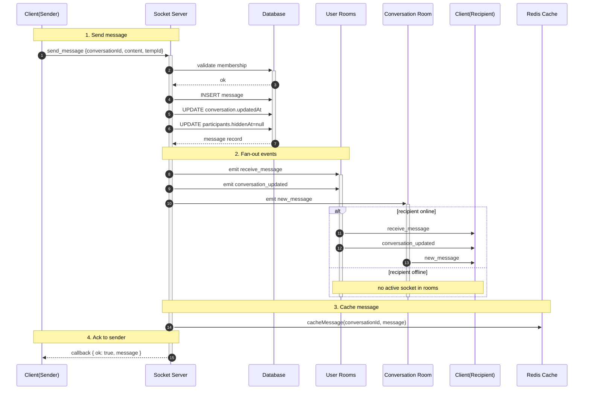
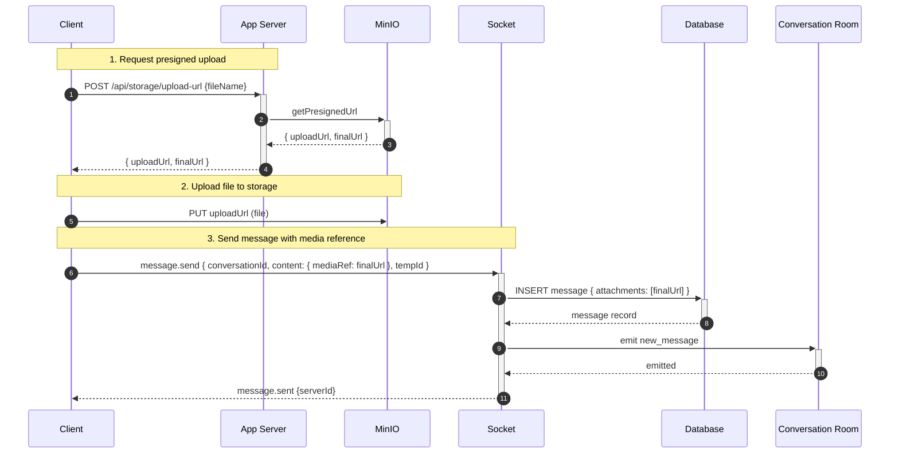
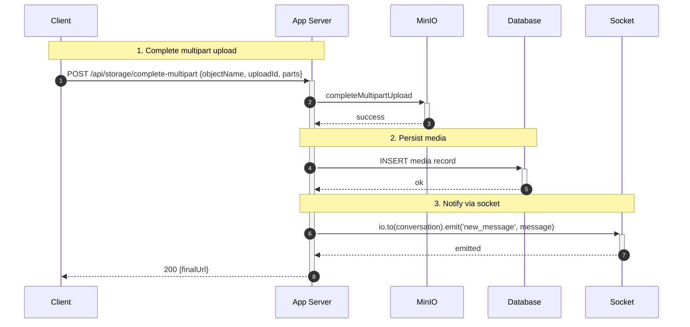
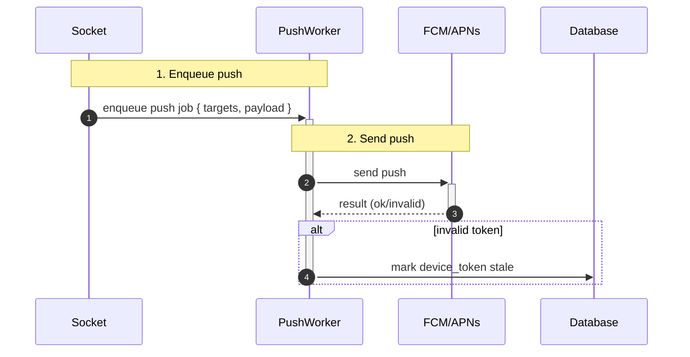

## Messaging — Gửi/Nhận tin nhắn

1. Tên chức năng
- Messaging: send/receive/store (text + media)

2. Mục đích
- Truyền tin nhắn realtime; đảm bảo lưu trữ (persist) và cơ chế xác nhận (ack, delivery, read receipts).

3. Actor
- Client người gửi (Sender), Client người nhận (Recipient), Socket server, REST API, Database, Push worker.

4. Input
- Sự kiện WS `message.send` hoặc REST `POST /conversations/:id/messages` (dự phòng). Payload bao gồm: `conversationId`, `content`, `attachments`, `clientTempId`.

5. Output
- Bản ghi message được lưu trong DB; các sự kiện WS `message.new`, `message.sent`, `message.delivered`, `message.read` được phát ra.

6. Flow xử lý (chi tiết)
- Khi gửi (tóm tắt, theo thứ tự và theo ranh giới transaction):
  1. Client gửi event WS `message.send` (kèm `clientTempId` cho optimistic UI).
  2. Server xác thực: kiểm tra membership, kiểm tra payload (size/type).
  3. Media check: nếu message có attachments theo flow presigned/multipart, đảm bảo upload đã hoàn tất hoặc chờ phần server-side complete trước khi persist attachments.
  4. Cấp `serverId` và bắt một DB transaction:
     - `INSERT` vào `messages` (chứa `serverId`, content, attachments nếu sẵn sàng).
     - `UPDATE` `conversations.updatedAt` / `conversations.last_message`.
     - `UPDATE` `participants.hiddenAt = NULL` (nếu cần).
  5. Commit transaction. Nếu transaction fail -> rollback và trả lỗi/ack lỗi cho sender.
  6. Sau khi commit (post-commit actions):
     - Emit các event realtime (`message.new`, `conversation.updated`...) tới các room/user tương ứng.
     - Cache message (Redis) để phục vụ listing/scroll nhanh.
     - Enqueue push job cho thiết bị offline (worker gửi FCM/APNs).
     - Gửi ack/`message.sent` tới sender (mapping `clientTempId` -> `serverId`).
  7. Lưu ý vận hành: đảm bảo idempotency (dup send), retry-safe, ordering khi cần (per-conversation sequence) và observability (logs/metrics).

- Delivery / Read receipts:
  - Client gửi `message.delivered` / `message.read` kèm `messageId`.
  - Server ghi nhận trạng thái per-user vào bảng `message_status` / `message_deliveries`.
  - Sau cập nhật, server emit event cập nhật tới sender/rooms (`message.delivered`, `message.read`).

- Ghi chú ngắn:
  - Tách rõ ranh giới: những thao tác cần atomic (DB transaction) và những thao tác post-commit (emit, cache, push).
  - Với media: upload phải hoàn tất trước khi persist attachments, hoặc lưu message tạm không kèm attachment và gửi update khi media available (chỉ dùng khi muốn tối ưu throughput).
  - Sử dụng `clientTempId` để hỗ trợ optimistic UI và reconcile khi server trả `serverId`.

7. Sequence Diagram

  
7.4 Detailed sub-flows (split for complexity)

7.4.1. WS send with attachment via presigned flow (client uploads media first):

7.4.2. Server-side multipart complete -> notify:

7.4.3. Offline delivery -> push flow (worker details):

8. API Design / Events
- WS: `message.send`, `message.new`, `message.sent`, `message.delivered`, `message.read`.
- REST: `POST /conversations/:id/messages` (multipart for direct upload).

9. Database liên quan
- `messages`, `message_attachments`, `message_status/message_deliveries`.

10. Validation / Business Rules
- Chỉ thành viên (member) mới được gửi tin nhắn; giới hạn dung lượng/định dạng attachment; rate-limit gửi tin nhắn để chống spam.

11. Error Handling
- `400` payload không hợp lệ; `403` không phải participant; `413` payload quá lớn; `500` lỗi storage/database.
  
12.  Tính năng mở rộng: Advanced Message Actions
- **Chỉnh sửa / Xoá / Thu hồi (Edit/Delete Message):**
  Client gọi API `PUT` hoặc `DELETE` -> DB cập nhật flag `isEdited` hoặc `isDeleted` -> Socket emit `message.edited` / `message.deleted` đến phòng (room).
- **Chuyển tiếp (Forward):**
  Lấy dữ liệu tin nhắn nguồn -> Tạo bản message copy mới kèm metadata `forwardedFrom` -> emit thông thường.
- **Chia sẻ Vị trí / GIF (Location / Giphy):**
  Vị trí và GIF được lưu dưới dạng `message_attachments` mang kiểu dữ liệu chuyên biệt (type=`location` với toạ độ lat/lng; type=`gif` lưu external URL). Luồng xử lý tương tự Media upload trực tiếp.

13. Cơ chế clientTempId (Optimistic UI & Reconciliation)
- **Mục đích:** 
  Giúp ứng dụng hiển thị tin nhắn ngay lập tức trên giao diện của người gửi ngay sau khi bấm nút "Gửi" (trạng thái "đang gửi"), thay vì phải chờ phản hồi phản hồi từ server, tạo trải nghiệm mượt mà không có độ trễ.
- **Quy trình hoạt động (Reconciliation):**
  1. **Tạo tempId:** Client tự sinh một ID tạm thời duy nhất (ví dụ: UUID hoặc timestamp) gọi là `tempId` và vẽ tin nhắn này lên màn hình chat ngay lập tức với trạng thái "Đang gửi".
  2. **Gửi lên Server:** Client gửi payload tin nhắn kèm theo `tempId` này lên Socket Server.
  3. **Xử lý và phản hồi:** Server nhận tin nhắn, lưu vào Database để lấy `id` chính thức của hệ thống (`serverId`), sau đó trả về Callback/Ack kèm theo cả `serverId` mới và `tempId` cũ.
  4. **Đồng bộ UI (Reconcile):** Client nhận được phản hồi, tìm tin nhắn đang hiển thị có `tempId` khớp trên màn hình để:
     - Cập nhật ID tạm thời thành ID thật từ hệ thống (`serverId`).
     - Chuyển trạng thái từ "Đang gửi" sang "Đã gửi".