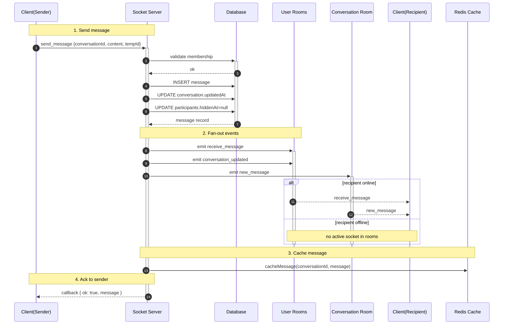
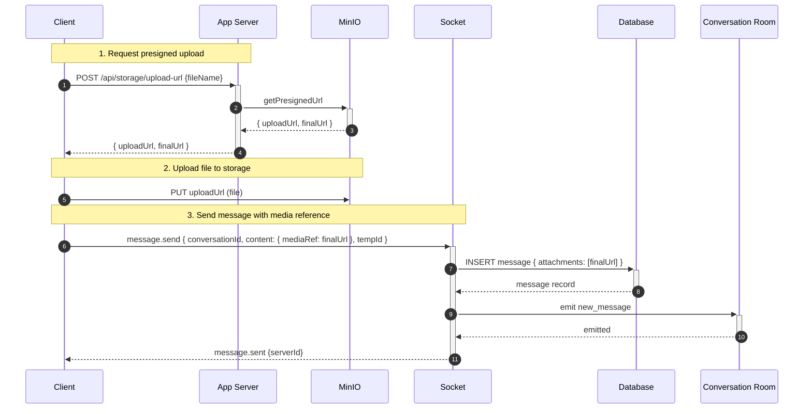
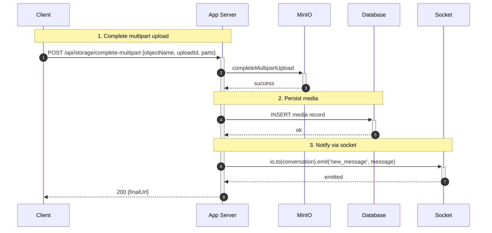
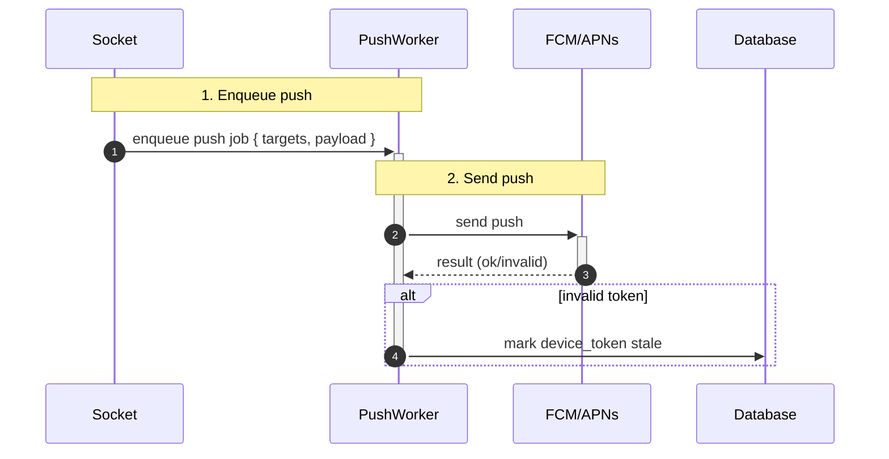

## Messaging — Gửi/Nhận tin nhắn

1. Tên chức năng
- Messaging: send/receive/store (text + media)

2. Mục đích
- Truyền tin nhắn realtime; đảm bảo lưu trữ (persist) và cơ chế xác nhận (ack, delivery, read receipts).

3. Actor
- Client người gửi (Sender), Client người nhận (Recipient), Socket server, REST API, Database, Push worker.

4. Input
- Sự kiện WS `message.send` hoặc REST `POST /conversations/:id/messages` (dự phòng). Payload bao gồm: `conversationId`, `content`, `attachments`, `clientTempId`.

5. Output
- Bản ghi message được lưu trong DB; các sự kiện WS `message.new`, `message.sent`, `message.delivered`, `message.read` được phát ra.

6. Flow xử lý (chi tiết)
- Khi gửi: xác thực membership và nội dung -> cấp server id -> trong transaction: chèn message, cập nhật `conversation.last_message` -> emit `new_message` tới room và các room theo từng user -> cache message -> enqueue job push cho thiết bị offline -> ack tới sender.
- Delivery/read receipts: client gửi sự kiện `delivered`/`read` -> server ghi nhận trạng thái theo user và phát cập nhật tới sender/room.

7. Sequence Diagram

  
7.4 Detailed sub-flows (split for complexity)

7.4.1. WS send with attachment via presigned flow (client uploads media first):

7.4.2. Server-side multipart complete -> notify:

7.4.3. Offline delivery -> push flow (worker details):

8. API Design / Events
- WS: `message.send`, `message.new`, `message.sent`, `message.delivered`, `message.read`.
- REST: `POST /conversations/:id/messages` (multipart for direct upload).

9. Database liên quan
- `messages`, `message_attachments`, `message_status/message_deliveries`.

10. Validation / Business Rules
- Chỉ thành viên (member) mới được gửi tin nhắn; giới hạn dung lượng/định dạng attachment; rate-limit gửi tin nhắn để chống spam.

11. Error Handling
- `400` payload không hợp lệ; `403` không phải participant; `413` payload quá lớn; `500` lỗi storage/database.
  
12.  Tính năng mở rộng: Advanced Message Actions
- **Chỉnh sửa / Xoá / Thu hồi (Edit/Delete Message):**
  Client gọi API `PUT` hoặc `DELETE` -> DB cập nhật flag `isEdited` hoặc `isDeleted` -> Socket emit `message.edited` / `message.deleted` đến phòng (room).
- **Chuyển tiếp (Forward):**
  Lấy dữ liệu tin nhắn nguồn -> Tạo bản message copy mới kèm metadata `forwardedFrom` -> emit thông thường.
- **Chia sẻ Vị trí / GIF (Location / Giphy):**
  Vị trí và GIF được lưu dưới dạng `message_attachments` mang kiểu dữ liệu chuyên biệt (type=`location` với toạ độ lat/lng; type=`gif` lưu external URL). Luồng xử lý tương tự Media upload trực tiếp.