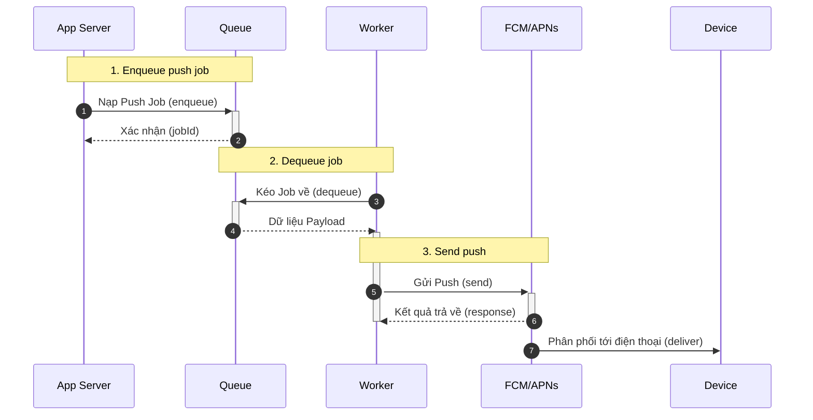
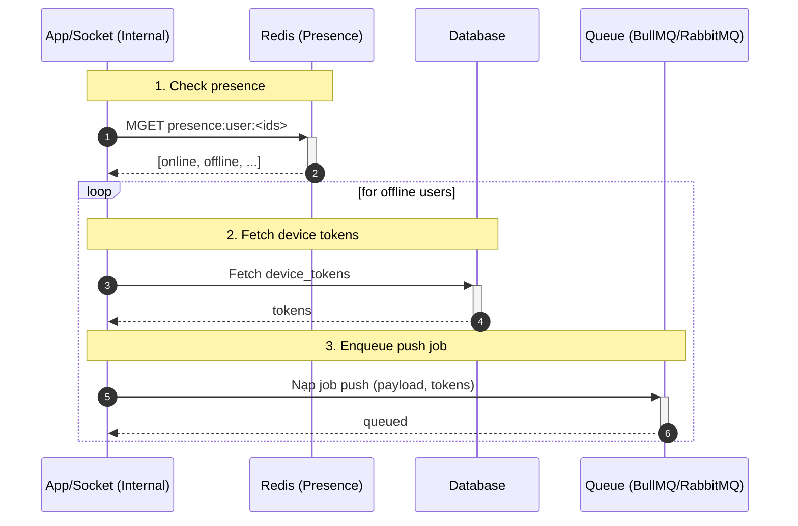
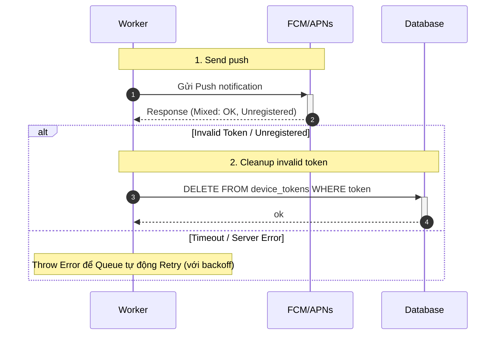

## Notifications — Push & In-app

1. Tên chức năng
- Notifications: push (FCM/APNs) and in-app notifications

2. Mục đích
- Thông báo người dùng về tin nhắn, cuộc gọi, friend-requests khi offline; lưu in-app history.

3. Actor
- App server, Notification queue/worker, FCM/APNs, Database, Client devices.

4. Input
- Nhận event nội bộ (ví dụ: message mới, cuộc gọi tới, yêu cầu kết bạn) có đính kèm user đích và thông tin thiết bị (devices).

5. Output
- Trạng thái kết quả đẩy thông báo (Push send results); ghi lưu (store) lại các notification object vào database để truy xuất; thông báo được đẩy thành công đến đích.

6. Flow xử lý (chi tiết)
- Khi có event: xác định các device đích -> nếu thiết bị đang online qua WS thì bỏ qua việc gửi push; nếu không thì enqueue job push -> worker tạo payload và gửi tới FCM/APNs -> xử lý response (cleanup invalid tokens).

7. Sequence Diagram

7.1 Chi tiết luồng kiểm tra trạng thái Online và gửi Push

7.2 Cơ chế Retry và Cleanup Token rác (Worker)

8. API Design
- Internal: `POST /notifications/send` (service-to-service).
- Client: `GET /notifications` to fetch in-app notifications.

9. Database liên quan
- `device_tokens` (user_id, token, platform, last_seen).
- `notifications` (id, user_id, payload, delivered, created_at).

10. Validation / Business Rules
- Tuân thủ cài đặt cấu hình thông báo (chẳng hạn tắt thông báo - mute, chế độ DND); gộp nhóm (group) tin báo tương tự nếu cần; chiến lược retry khi gặp lỗi mạng tạm thời.

11. Error Handling
- Thực hiện Retry với những lỗi tạm thời; đánh dấu và dọn dẹp các token device lỗi; ghi chú log đầy đủ những lần thử bị fail.
