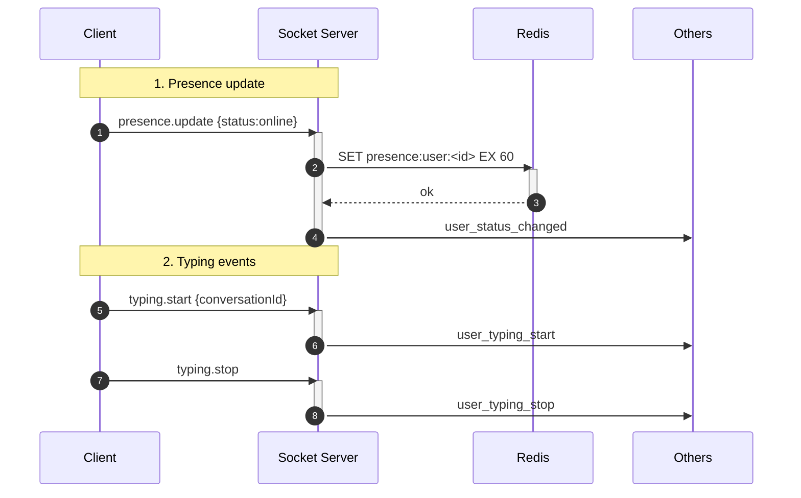
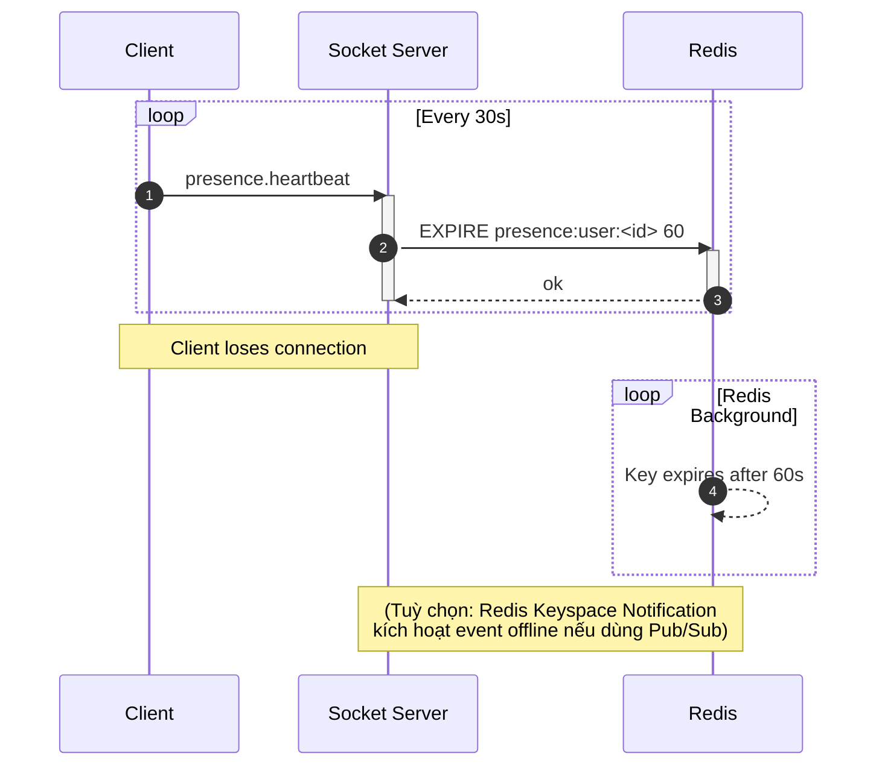
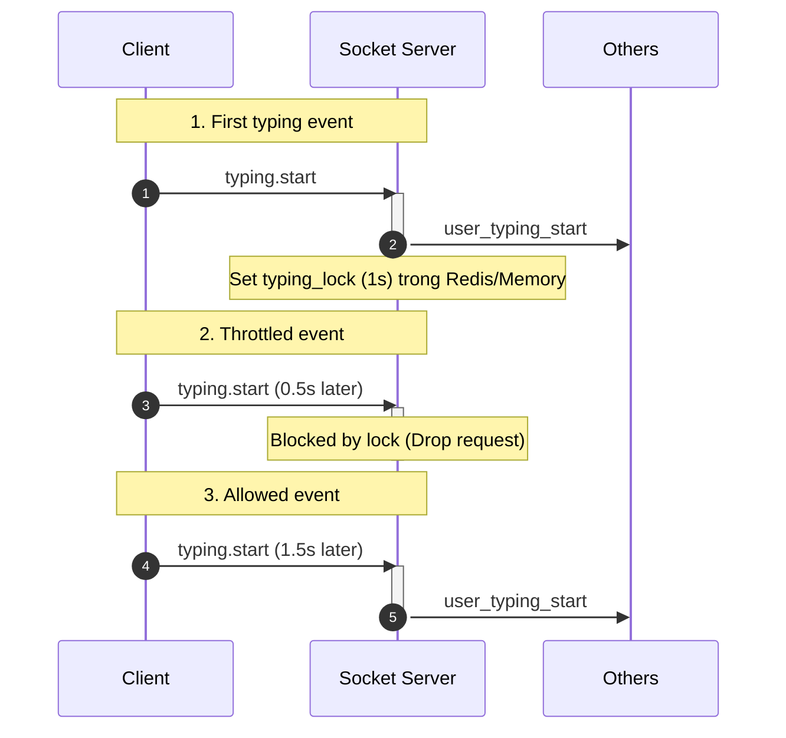

## Presence & Typing — Trạng thái & Gõ

1. Tên chức năng
- Presence (online/offline/status) và Typing Indicator

2. Mục đích
- Cập nhật trạng thái online/offline và thông báo người dùng đang gõ trong conversation.

3. Actor
- Client kết nối, Socket server, Redis (kho lưu presence kiểu ephemeral thông qua TTL), các participants liên quan.

4. Input
- Nhận event WS: `presence.update`, `presence.heartbeat`, `typing.start`, `typing.stop`.

5. Output
- Server broadcast emit events các tín hiệu: `user_status_changed`, `user_typing_start`, `user_typing_stop`.

6. Flow xử lý (chi tiết)
- Khi connect: authenticate -> set `presence:user:<id>` trong Redis với TTL -> broadcast tới followers/participants.
- Heartbeat: client refresh TTL để giữ online.
- Disconnect: TTL hết hạn hoặc client gửi offline -> broadcast offline.
- Typing: throttle/suppress sự kiện `typing.start` lặp -> broadcast `user_typing_start`/`user_typing_stop`.

7. Sequence Diagram


7.1 Chi tiết luồng Heartbeat & TTL expiration


7.2 Chi tiết luồng Typing throttle (Chống spam)

```

8. API Design / Events
- WS only (preferred): `presence.update`, `presence.heartbeat`, `typing.start`, `typing.stop`.
- Optional REST: `GET /users/:id/presence`.

9. Database liên quan
- Ephemeral presence stored in Redis; long-term analytics stored separately if needed.

10. Validation / Business Rules
- Status có tính TTL lưu trữ trực tiếp; thực hiện chặn lặp sự kiện typing (throttle) chống quá tải (ví dụ: dedupe = 1 giây); bảo vệ private bằng việc emit typing event chỉ cho participant.

11. Error Handling
- Bỏ qua các sự kiện ko đúng chuẩn; log ra lại các trường hợp lạm dụng hệ thống; rate-limit với các loại heartbeat/update quá dồn dập.
