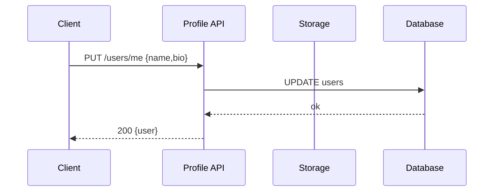

## User Profile — Quản lý profile

1. Tên chức năng
- User Profile Management (read/update avatar/settings)

2. Mục đích
- Cho phép người dùng đọc và cập nhật thông tin cá nhân, avatar và preferences.

3. Actor
- User client, Profile API, Storage (MinIO), Database.

4. Input
- Gọi REST: `GET /users/:id`, `PUT /users/me { displayName, bio, settings }`, trường hợp upload avatar thì chạy theo luồng presigned/multipart.

5. Output
- Trả về đối tượng JSON `user` object bao gồm phần fields nâng cấp / update.

6. Flow xử lý (chi tiết)
- Read: authenticate -> lấy user row từ DB -> trả về dữ liệu.
- Update: authenticate -> kiểm tra quyền sở hữu -> cập nhật các trường -> nếu có avatar thì presign/upload -> cập nhật `avatar_url`.

7. Sequence Diagram

8. API Design
- `GET /users/:id`
- `PUT /users/me`
- `POST /users/me/avatar/presign`
- `POST /users/me/avatar/complete`

9. Database liên quan
- `users` (profile fields).
- `user_media` (avatar/media metadata).

10. Validation / Business Rules
- Chỉ duy nhất người chủ sở hữu của profile (owner) đó có quyền thay đổi.
- Quy định avatar giới hạn định dạng loại hình ảnh và dung lượng size file (ví dụ: hình tối đa 5MB).

11. Error Handling
- `400` data không hợp lệ; `403` cấm cập nhật/không có quyền; `413` tải trọng (payload) kích thước quá lớn; `500` server lỗi hoặc storage lỗi.
