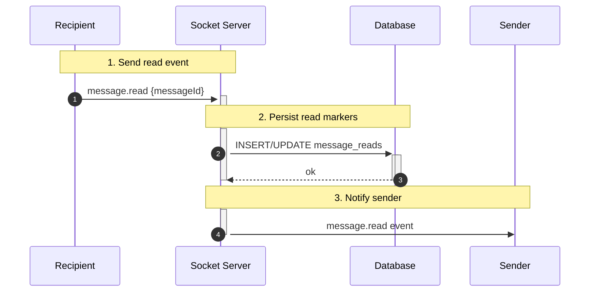
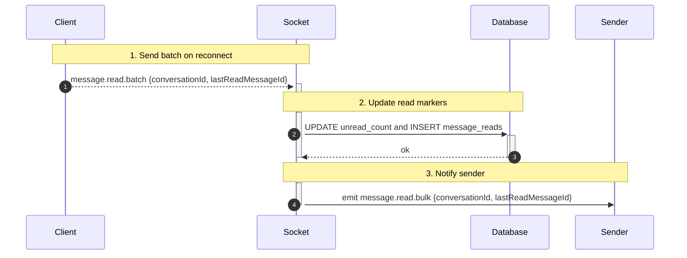

## Read Receipts — Seen

1. Tên chức năng
- Read Receipts / Message Seen tracking

2. Mục đích
- Ghi nhận và thông báo khi người nhận đã đọc tin nhắn; cập nhật unread counts.

3. Actor
- Recipient client, Socket server, Database, Sender client.

4. Input
- Sự kiện WS: `message.read` hoặc bulk event thông báo nguyên cục `message.read.batch` gồm JSON payload `{conversationId, lastReadMessageId}`.

5. Output
- Cập nhật database markers điểm trỏ (read markers); phân phát broadcast emit sự kiện `message.read` / `message.read.bulk` theo phía sender hoặc theo room tương ứng; thực thi cập nhật giảm trừ số lượng `unread_counts` nằm trong table theo conversation.

6. Flow xử lý (chi tiết)
- Khi nhận `message.read`: xác thực membership -> insert/update `message_reads` -> cập nhật `unread_count` -> emit tới sender/room.
- Batch: nhận phạm vi/range hoặc `lastReadId` để cập nhật nhiều message trong một thao tác.

7. Sequence Diagram

-
7.1 Batch / reconnect flow (detailed):

7.2 Ordering & idempotency notes
- Server should persist lastReadMessageId per user and ignore older timestamps; batch updates should be applied atomically to avoid race conditions.

8. API Design
- WS: `message.read`, `message.read.batch`.
- Fallback REST: `POST /messages/:id/read`.

9. Database liên quan
- `message_reads` (message_id, user_id, read_at) and aggregated `conversation_participants.unread_count`.

10. Validation / Business Rules
- Cần nằm trong member để gửi yêu cầu chuyển status đọc; phớt lờ xử lý nếu có timestamps cũ chèn vào ngắt timeline; khi reconnect ưa tiên đồng bộ sử dụng batch update.

11. Error Handling
- `403` báo lỗi rớt quyền member; `404` trường hợp message không thấy; chú ý kiểm soát chặt chẽ cơ chế idempotency.
