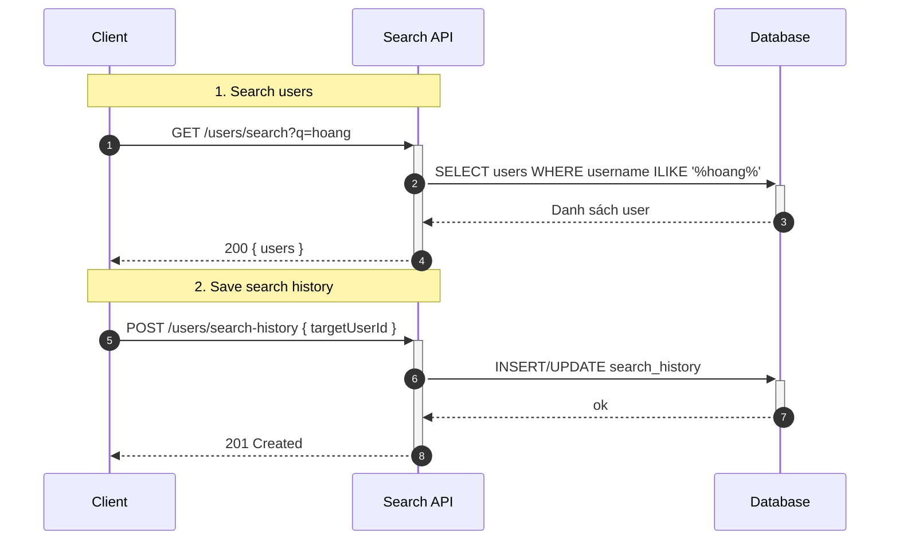

## Search & History — Tìm kiếm và Lịch sử

1. Tên chức năng
- Search & History (Tìm kiếm người dùng, Tìm kiếm tin nhắn, Lưu/Xóa lịch sử tìm kiếm)

2. Mục đích
- Giúp người dùng tra cứu nhanh bạn bè, tin nhắn cũ và quản lý các từ khoá/tài khoản đã tìm kiếm gần đây.

3. Actor
- Client người dùng, REST API, Database.

4. Input
- Tìm kiếm Users: `GET /users/search?q=...`
- Tìm kiếm Messages: `GET /chat/searchMessages?q=...&conversationId=...`
- Lưu lịch sử: `POST /users/search-history`
- Xem/Xoá lịch sử: `GET /users/search-history`, `DELETE /users/search-history/:id`, `DELETE /users/search-history` (clear all).

5. Output
- Danh sách kết quả (Users hoặc Messages) hỗ trợ phân trang.
- Danh sách lịch sử trích xuất từ database.

6. Flow xử lý (chi tiết)
- Tìm kiếm (Search): Client gửi từ khoá `q` -> Trích xuất query dùng pattern matching (vd: ILIKE) -> lấy kết quả từ database -> trả về danh sách ngắm trúng.
- Lưu lịch sử (Save History): Khi user click vào một người dùng cụ thể từ thanh search -> gọi API lưu lịch sử tìm kiếm (upsert/update thời gian `last_searched`) -> cập nhật cache/database.
- Dọn dẹp: Xoá từng bản ghi hoặc xóa toàn bộ lịch sử (clear) -> thực thi lệnh DELETE trên DB theo `user_id`.

7. Sequence Diagram

8. API Design / Events
- `GET /users/search`, `GET /chat/searchMessages`
- `GET /users/search-history`
- `POST /users/search-history`
- `DELETE /users/search-history/:id` (Xong một mục)
- `DELETE /users/search-history/clear` (Xóa tất cả)

9. Database liên quan
- `users` (query tìm kiếm account).
- `messages` (query tìm text).
- `search_history` (user_id, searched_user_id, search_query, created_at).

10. Validation / Business Rules
- Escape chuỗi search (phòng chống SQL Injection); giới hạn số lượng search history tối đa mỗi account (ví dụ: chỉ giữ 20 recents); phân trang kết quả tìm kiếm tin nhắn (tránh query quét toàn bộ DB gây chậm hệ thống).

11. Error Handling
- `400` query string quá ngắn/trống; `404` không tìm thấy lịch sử để xóa; `500` lỗi DB khi full-text search.